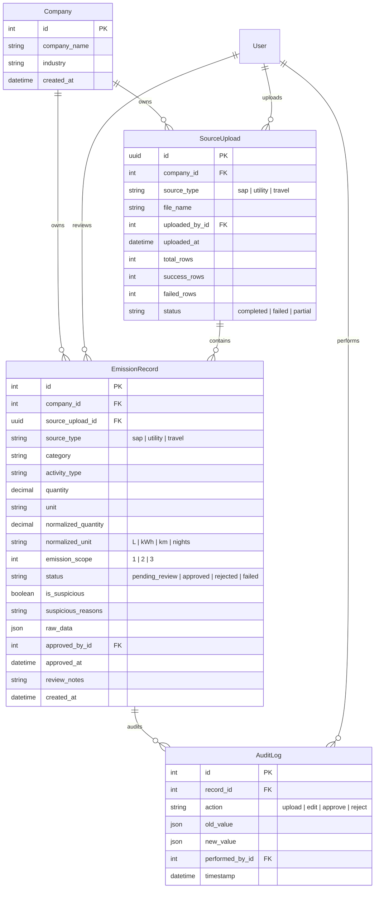

# Data Model & Compliance Architecture

The CarbonFlow ESG Platform database is structured to balance strict client data isolation, data preservation, automated unit normalization, and audit transparency.

---

## 1. Entity-Relationship Diagram

---

## 2. Multi-Tenancy Architecture

To support corporate client isolation:
* **Tenant Segregation**: All uploaded files (`SourceUpload`) and individual ledger rows (`EmissionRecord`) contain a `company` foreign key referencing the `Company` model.
* **Query Scoping**: Analysts cannot query records without passing a `company_id`. The React frontend Context enforces a global active tenant, appending `?company_id=<id>` to all queries.
* **Database Indexes**: Databases indexes are placed on the `company_id` column alongside filter states (`status`, `is_suspicious`) in `EmissionRecord` to ensure rapid page queries.

---

## 3. Data Normalization & Scope Mapping Strategy

Mesy source data is standardized into uniform units based on Greenhouse Gas (GHG) Protocol guidance:

### Unit Normalization Logic
* **Scope 1 (SAP Fuel & Procurement)**:
  * Liquid fuels are normalized to Liters (`L`). Gallons (`Gal`) are converted via `qty * 3.78541`.
  * Gases (e.g. Natural Gas) are normalized to Cubic Meters (`m3`).
* **Scope 2 (Utility Electricity)**:
  * Energy inputs are normalized to Kilowatt-hours (`kWh`). Megawatt-hours (`MWh`) are converted via `qty * 1000` and Watt-hours (`Wh`) via `qty / 1000`.
* **Scope 3 (Corporate Travel)**:
  * Distances are normalized to Kilometers (`km`). Miles (`mi`/`miles`) are converted via `qty * 1.60934`.
  * Hotel stays are normalized to `nights`.

### Scope Mapping rules
* **Scope 1 (Direct Emissions)**: Assigned to all `SAP Fuel & Procurement` source uploads.
* **Scope 2 (Indirect Emissions)**: Assigned to all `Utility Electricity` source uploads.
* **Scope 3 (Value Chain Emissions)**: Assigned to all `Corporate Travel` source uploads.

---

## 4. Compliance Audit Trail System

To satisfy compliance officers and financial auditors, every database transaction is tracked:
1. **Raw Data Preservation**: The original messy CSV row is preserved as-is inside the `raw_data` `JSONField` of `EmissionRecord`. This allows validation code edits to re-run calculations in the future without losing original inputs.
2. **Immutable Audit Diffing**: Modifying a record or shifting its status (Approve/Reject) writes a row to `AuditLog`. It saves complete JSON diff snapshots (`old_value` and `new_value`) side-by-side.
3. **Audit Resilience**: If a record is deleted, its `AuditLog` references are set to `SET_NULL` rather than cascading, leaving the historical log trail fully intact.
